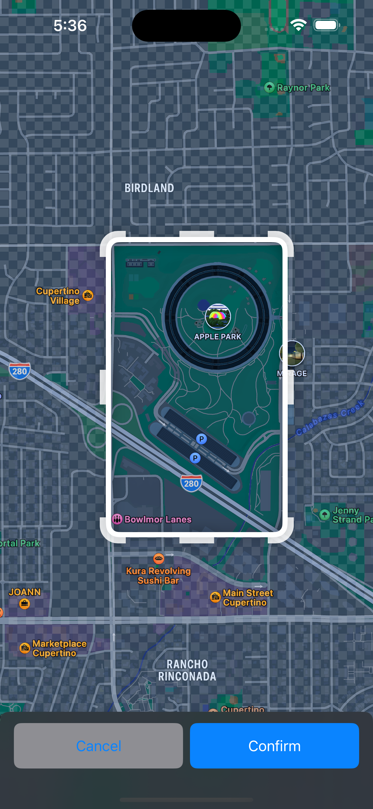

# RegionSelectionView
Simple view to select a MKCoordinateRegion inspired by the Apple Maps app. 

 

## Example App
An example app is available to showcase usage and functionaility. It can be found in `./RegionSelectionViewDemo`. 

## Requirements
- Deployment target iOS 17.0+
- Swift 5.9+

## Installation

### Swift Package Manager
To install `SwiftyProse` using [Swift Package Manager](https://swift.org/package-manager/), add `.package(name: "SwiftyProse", url: https://github.com/MaciDE/RegionSelectionView.git", from: "1.0.0"),"` to your Package.swift, then follow [this](https://swift.org/package-manager#importing-dependencies) integration tutorial. 
